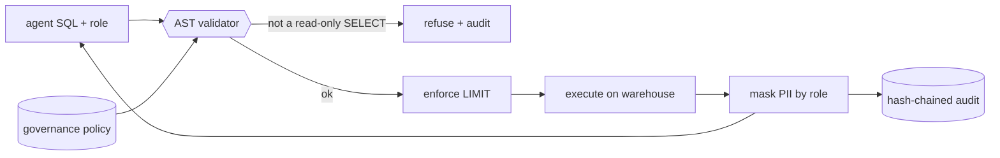

# mcp-sql-guard

> **Give an agent read access to your warehouse without the write risk, injection,
> or data exposure.** A Model Context Protocol server that parses every statement
> to an abstract syntax tree and clears it only if it is a single read-only,
> allow-listed SELECT. It enforces a LIMIT, masks PII columns unless the caller's
> role is entitled to them, and records every decision in a tamper-evident audit
> log. Runs fully offline on a bundled DuckDB warehouse.

[](https://github.com/tahasiddiquii/mcp-sql-guard/actions/workflows/ci.yml)


Handing an agent a database connection is the fastest way to turn a helpful tool
into a data breach: a generated `DROP`, a `read_csv('/etc/passwd')`, a `UNION` into
system tables, or a plain `SELECT email` that leaks customer PII to whoever is
asking. String matching does not stop these; the query has to be understood. This
server validates on the AST and governs at the column level, built from my
text-to-SQL and guardrails work.

## What this demonstrates

| Governance control | Where |
| --- | --- |
| Single read-only SELECT, verified on the AST | [validator.py](src/mcp_sql_guard/validator.py) |
| Table allowlist, CTE-aware so CTE names are not mistaken for tables | [validator.py](src/mcp_sql_guard/validator.py) |
| File and system functions blocked (`read_csv`, `copy`, `attach`, ...) | [config.py](src/mcp_sql_guard/config.py) |
| LIMIT injected when absent, capped when too large | [validator.py](src/mcp_sql_guard/validator.py) |
| Column-level PII masking, alias and `SELECT *` aware | [validator.py](src/mcp_sql_guard/validator.py) · [masking.py](src/mcp_sql_guard/masking.py) |
| Role entitlement for PII (`read_pii`) | [config.py](src/mcp_sql_guard/config.py) |
| Tamper-evident audit log | [audit.py](src/mcp_sql_guard/audit.py) |
| Governance gate in CI | [evals.py](src/mcp_sql_guard/evals.py) |

## Architecture



## Quickstart

```bash
make dev            # venv + install -e ".[dev]"

sqlguard schema     # the queryable schema, PII marked
sqlguard demo       # benign, masked, and blocked queries
sqlguard query "SELECT name, email FROM customers" --role analyst   # email masked
sqlguard eval       # the governance gate
sqlguard serve --role analyst                                       # live MCP server over stdio
```

No keys, no network. The warehouse is a bundled in-memory DuckDB. Point at a real
database in production by swapping the connection in [engine.py](src/mcp_sql_guard/engine.py);
the validation and masking logic is unchanged.

## The gate that matters

`sqlguard eval` replays governed and adversarial queries ([report](reports/governance_report_example.md)):

| metric | value | gate |
| --- | --- | --- |
| **unsafe_executed** | **0** | = 0 |
| **pii_exposed** | **0** | = 0 |
| privileged_pii_visible | True | true |
| execution_accuracy | 1.000 | >= 0.90 |
| false_block_rate | 0.000 | <= 0.10 |

The two zeros are the contract. `unsafe_executed` counts any write, multi-statement,
file-access, or non-allow-listed query that ran; it must be zero. `pii_exposed`
counts any raw email or phone number that reached a role without `read_pii`; it
must be zero. `privileged_pii_visible` confirms masking is a role decision, not a
blanket blackout: a privacy officer still sees the data. Recall and false-block
confirm ordinary analytics still work. CI fails if any gate slips.

## What it catches

`sqlguard demo` over sample traffic:

- **Writes and DDL.** `DROP`, `INSERT`, `UPDATE`, and anything that is not a SELECT
  is refused before it reaches the database.
- **Multi-statement smuggling.** `SELECT ...; DROP TABLE ...` is rejected as more
  than one statement.
- **File and system access.** `read_csv`, `copy`, `attach`, and friends are blocked,
  so the query cannot escape the warehouse.
- **Metadata exfiltration.** A `UNION` into system tables is refused because unions
  and non-allow-listed tables are not permitted.
- **PII exposure.** An analyst selecting `email`, `email AS contact`, or `SELECT *`
  gets the column masked; a privacy officer with `read_pii` gets the value.

## Design decisions

- **Validate on the AST, not the string.** A query is understood, not pattern
  matched, so obfuscation and aliasing do not get past the checks.
- **Mask cannot be renamed away.** PII masking is computed from the projection,
  including alias resolution and `SELECT *` expansion, so `email AS x` is still
  masked.
- **Least privilege by default.** PII is masked unless a role is explicitly granted
  `read_pii`. The policy YAML is written to be read in review.
- **Fail closed.** A parse error, an unknown table, or an execution error is a clean
  denial, never an uncaught path.

## Layout

```
src/mcp_sql_guard/  config · schema · validator · masking · engine · audit · guard · server · evals · cli
data/  policy.example.yaml · eval_cases.jsonl
reports/  governance_report_example.md
```

## Related repositories

Part of a portfolio on production ML and LLM engineering:

- [analytics-copilot](https://github.com/tahasiddiquii/analytics-copilot): text-to-SQL analytics agent with an sqlglot validator
- [mcp-guardrail-gateway](https://github.com/tahasiddiquii/mcp-guardrail-gateway): security gateway for MCP servers
- [mcp-knowledge-server](https://github.com/tahasiddiquii/mcp-knowledge-server): permission-aware knowledge MCP server
- [llm-guardrails-redteam](https://github.com/tahasiddiquii/llm-guardrails-redteam): model I/O guardrails and red-teaming
- **mcp-sql-guard**: this repo.

## License

MIT (c) 2026 Taha Siddiqui
